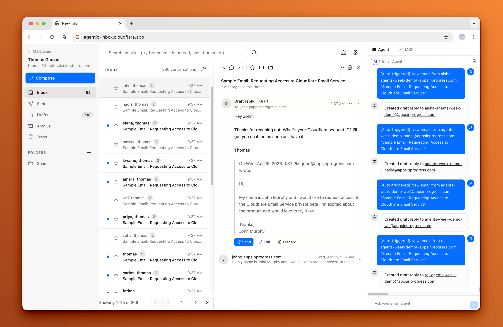

# Agentic Inbox

A self-hosted email client on Cloudflare Workers, with separate mailbox storage and AI agents for searching, drafting, and sending messages.

[Deploy upstream on Cloudflare](https://deploy.workers.cloudflare.com/?url=https://github.com/cloudflare/agentic-inbox) · [Upstream](https://github.com/cloudflare/agentic-inbox) · [简体中文](./README.md)



## Features

- Receive mail through Cloudflare Email Routing and send through Email Service, with conversations, search, attachments, and folders.
- A separate Durable Object and SQLite database for each mailbox; attachments stored in R2.
- An email agent that can read, search, draft, and send messages.
- Automatic drafts for new messages, with human confirmation before sending.
- Cloudflare Access protection for the web interface and MCP endpoint.

## Usage

Requires a Cloudflare account, a domain with Email Routing enabled, R2, Workers AI, Email Service, and Cloudflare Access.

```bash
npm install
npm run dev
```

Set your domain in `wrangler.jsonc`. Create the R2 bucket if it does not already exist:

```bash
npx wrangler r2 bucket create agentic-inbox
npm run deploy
```

For production, configure `POLICY_AUD` and `TEAM_DOMAIN` for Cloudflare Access. After deployment, create a catch-all Email Routing rule pointing to the Worker and configure Email Service. Missing Access settings cause production requests to fail closed.

## Notes

Cloudflare Access is the shared trust boundary. Every user allowed by the same Access policy can access all mailboxes; MCP clients can operate on any mailbox through `mailboxId`. The project does not provide per-mailbox authorization. Local development skips Access validation.

Messages and attachments are stored on Cloudflare, and AI features process message content through the configured Workers AI service. Keep real emails and credentials out of repository files and public issue reports.

## License

The project is distributed under the [Apache License 2.0](./LICENSE). Upstream copyright belongs to Cloudflare, Inc. and its contributors. Preserve existing upstream notices; personal branding, assets, and user data are excluded.

See [license scope](./LICENSE_SCOPE.md) for the boundaries.
